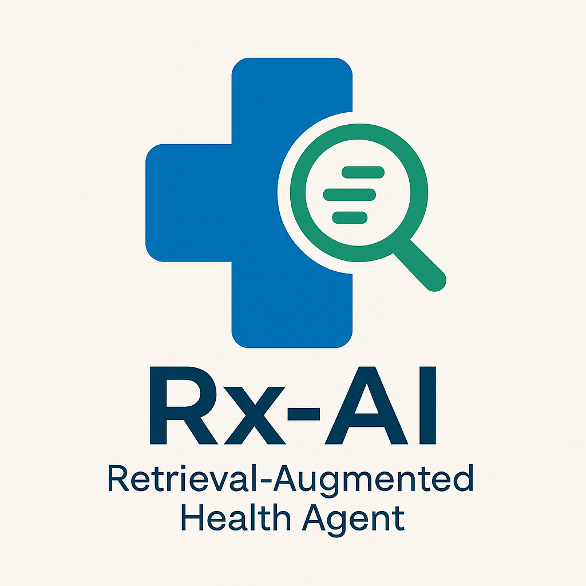

# Rx-AI: Retrieval-Augmented Health Agent

A working prototype of the Rx-AI system described in the paper "Rx-AI: A Retrieval-Augmented Health Agent for Truly Personal Care".
<p align="center">
  
</p>

# Rx-AI: Retrieval-Augmented Health Agent

## Features
- **FastAPI** backend with a `/chat` endpoint
- **RAG pipeline** supporting FAISS (local) and Pinecone (hosted)
- **FHIR-inspired** user profile manager
- **Safety module** for emergency detection and disclaimers

## Getting Started

1. Clone the repo:
   ```
   git clone https://github.com/your-org/rx_ai_health_agent.git
   cd rx_ai_health_agent
   ```

2. Create a `.env` file from the example:
   ```
   cp .env.example .env
   ```

3. Install dependencies:
   ```
   pip install -r requirements.txt
   ```

4. Run the app:
   ```
   uvicorn app.main:app --reload
   ```

## Vector Database Setup

This project supports two backends:

- **FAISS**: Local index at `VECTOR_DB_PATH`
- **Pinecone**: Hosted index. Set `PINECONE_API_KEY`, `PINECONE_ENV`, `PINECONE_INDEX`

## Testing and CI

A basic `pytest` test is included in `tests/test_rag.py`. A GitHub Actions workflow is defined in `.github/workflows/ci.yml`.

